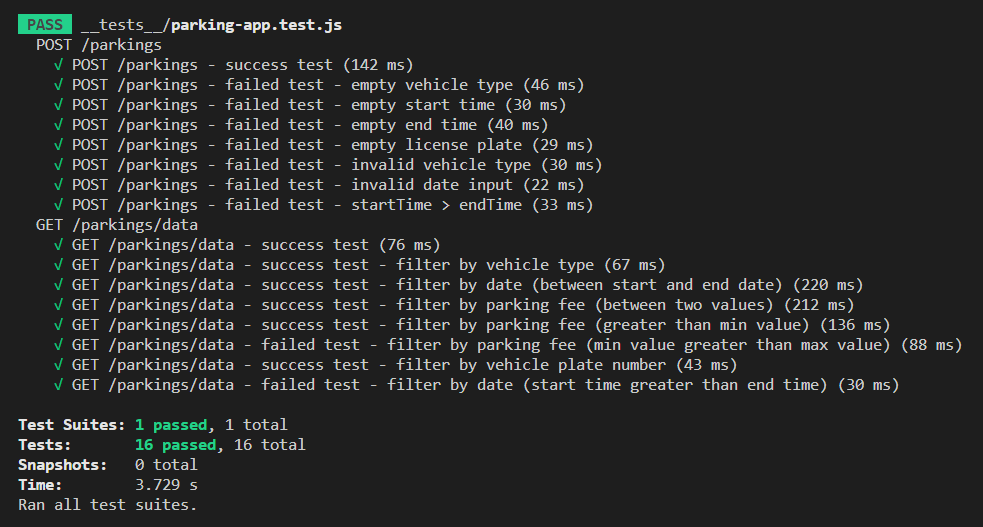

# parking-app

A simple parking app application which allow user to add new parking data and see all parking data report. Parking fee will automatically calculated based on vehicle type and the parking duration.

**Created using React Js and Postgresql**

## Project Setup

- **Server**

  **Install depedency modules**

  ```
  npm install
  ```

  **Run and compile server scripts**

  ```
  npm run dev
  ```

  **Run server unit test**

  First, uncomment scripts in `.sequelizerc` file. And then create and migrate new database_test using:

  ```
  npx sequelize db:create
  npx sequelize db:migrate
  ```

  **Run the test**

  ```
  npm run test
  ```

  After running server test, comment scripts in `.sequelizerc` file.

- **Client**

  **Install depedency modules**

  ```
  npm install
  ```

  **Run and compile server scripts**

  ```
  cd parking-app
  npm start
  ```

## Endpoints

List of Available Endpoints:

- `POST /parkings`
- `GET /parkings/data`

### POST /parkings

#### Description

- Add new parking data

#### Request

- Body

  ```json
  {
    "vehicleType": String,
    "startTime": Date,
    "endTime": Date,
    "licensePlate": String,
  }
  ```

#### Response

_201 - Created_

- Body

  ```json
  {
    "result": {
      "id": Integer,
      "username": String,
      "email": String,
    }
  }
  ```

  _400 - Bad Request_

- Body

  ```json
  {
    "message": "Vehicle type is required"
  }
  OR
  {
    "message": "Invalid vehicle type"
  }
  OR
  {
    "message": "Start time is required"
  }
  OR
  {
    "message": "End time is required"
  }
  OR
  {
    "message": "Input must be a valid date"
  }
  OR
  {
    "message": "Start time cannot be greater than the end date"
  }
  OR
  {
    "message": "License plate is required"
  }

  ```

### GET /parkings/data

#### Description

- Get all parking data reports. User can filter data based on vehicle type, minimum and maximum parking fee, start date and end date, and vehicle license plate.

#### Response

_200 - OK_

- Body

  ```json
  {
    "count": Integer,
    "rows": [
      {
        "id": Integer,
        "vehicleType": String,
        "startTime": Date,
        "endTime": Date,
        "parkingFee": Integer,
        "licensePlate": String
      },
      ...
    ]
  },
  ```

  _400 - Bad Request_

- Body

  ```json
  {
    "message": "Min fee cannot be greater than the max fee"
  }
  OR
  {
    "message": "Start date cannot be greater than the end date"
  }
  ```

### Global Error

#### Response

_400 - SequelizeValidationError_ OR _400 - SequelizeUniqueConstraintError_

## Screenshots

### Add Data


### Report Data


### Server Test


